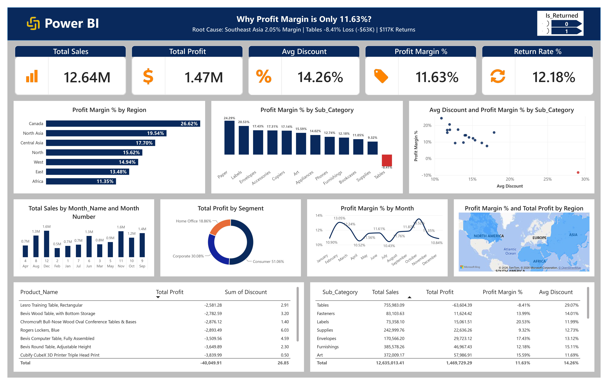

# Global Superstore Sales & Profitability Analysis
### End-to-End SQL Server + Power BI Project

**One-line summary:** A retailer with $12.64M in sales is converting only **11.63%** of it into profit. This project traces that leak through SQL data cleaning, KPI modeling, and an interactive Power BI dashboard down to its root cause — one region, one sub-category, and one discounting pattern.



---

## Business Problem

Leadership needs to know *which regions, categories, and discount practices* are eroding profitability, and how much returns are compounding the loss — so corrective action can be targeted instead of applied blindly across the whole business.

## Tech Stack

| Layer | Tool |
|---|---|
| Database Engine | Microsoft SQL Server (T-SQL) |
| BI / Visualization | Power BI Desktop |
| Data Prep | SQL Views, `LTRIM`/`RTRIM`, `CAST`, `DATEDIFF` |
| Version Control | Git & GitHub |

## Dataset

The **Global Superstore** dataset (2011–2014), loaded into SQL Server as three related tables:

| Table | Rows | Description |
|---|---|---|
| `dbo.Orders` | 51,291 | Fact table — one row per order line |
| `dbo.People` | 14 | Dimension — maps each Region to its Regional Manager |
| `dbo.Returns` | ~800+ | Flag table — Order IDs that were returned |

**Relationships:** `Orders.Region → People.Region`, `Orders.Order_ID → Returns.Order_ID`

---

## SQL Work

All SQL lives in [`01_sql_queries/01_global_superstore_analysis.sql`](./01_sql_queries/01_global_superstore_analysis.sql), organized into four stages:

1. **Data Profiling (EDA)** — row counts, schema check, null audit (found 41 rows with missing Profit), duplicate checks (caught 1 duplicate `Order_ID` in Returns).
2. **Data Cleaning (Views)** — `vw_CleanOrders`, `vw_CleanReturns`, `vw_CleanPeople` sit on top of the raw tables so nothing is edited in place and every transform stays auditable.
3. **KPI Queries** — four queries answering: headline company metrics, return impact, weakest-margin region, and weakest-margin sub-category.
4. **Final Model** — `vw_Final_Superstore_Dashboard`, a single governed view joining the cleaned fact and dimension layers, which is the *only* object Power BI connects to.

```sql
CREATE VIEW dbo.vw_Final_Superstore_Dashboard AS
SELECT o.*, p.Person AS Regional_Manager,
       CASE WHEN r.Order_ID IS NOT NULL THEN 1 ELSE 0 END AS Is_Returned
FROM dbo.vw_CleanOrders o
LEFT JOIN dbo.vw_CleanPeople p  ON o.Region = p.Region
LEFT JOIN dbo.vw_CleanReturns r ON o.Order_ID = r.Order_ID;
```

## Power BI Dashboard

- Single fact view imported in **Import mode** — no manual relationship-building, since joins were resolved upstream in SQL
- DAX measures: Total Sales, Total Profit, Profit Margin %, Avg Discount, Return Rate %
- KPI card strip, `Is_Returned` slicer, Profit Margin % by Region, Profit Margin % by Sub-Category, Discount-vs-Margin scatter plot, monthly sales/margin trends, segment donut, regional map, and two detail tables

## Key KPIs

| KPI | Value |
|---|---|
| Total Sales | **$12.64M** |
| Total Profit | **$1.47M** |
| Average Discount | **14.26%** |
| Profit Margin | **11.63%** |
| Return Rate | **12.18%** |

## Key Insights

1. **Tables is the single biggest profit leak** — the only sub-category with a negative margin (**-8.41%**), losing ~$63.6K on $755.9K in sales, while Paper leads at 24.29%.
2. **Discount and margin move in opposite directions** — Tables also carries the highest average discount (~29%), pointing to over-discounting as a direct driver of the loss.
3. **Regional performance is uneven** — Canada leads at 26.62% margin, while Southeast Asia is the weakest performer company-wide at ~2.05%.
4. **Consumer is the most valuable segment** — driving 51.06% of total profit, more than Corporate (30.08%) and Home Office (18.86%) combined.
5. **Returns are a meaningful drag** — a 12.18% return rate justifies its own slicer on the dashboard rather than a footnote.

## How to Run

1. Get the Global Superstore dataset (see [`04_dataset`](./04_dataset)) and restore it into SQL Server as `dbo.Orders`, `dbo.People`, `dbo.Returns`.
2. Run [`01_sql_queries/01_global_superstore_analysis.sql`](./01_sql_queries/01_global_superstore_analysis.sql) top to bottom in SSMS to create the cleaning views and `vw_Final_Superstore_Dashboard`.
3. In Power BI Desktop: **Get Data → SQL Server** → import `vw_Final_Superstore_Dashboard` (Import mode).
4. Open the `.pbix` in [`02_powerbi_file`](./02_powerbi_file) and hit **Refresh**.

## Results

The analysis pinpoints exactly where profitability is leaking: a single sub-category (**Tables**) driven by aggressive discounting, concentrated in specific underperforming regions, and further compounded by a double-digit return rate. Fixing discount policy on Tables alone is the single highest-leverage way to recover margin without touching sales volume.

---

## Author

**Hafiz Arslan Shafique** — Data Analyst
📧 hafiz.shafique@esom.com.sa · 🔗 [LinkedIn](https://www.linkedin.com/in/hafiz-arslan-shafique-bc240203664) · 💻 [GitHub](https://github.com/Hafiz-Arslan-Shafique)

Repo: [github.com/Hafiz-Arslan-Shafique/global-superstore-profitability-analysis-sql-powerbi](https://github.com/Hafiz-Arslan-Shafique/global-superstore-profitability-analysis-sql-powerbi)
